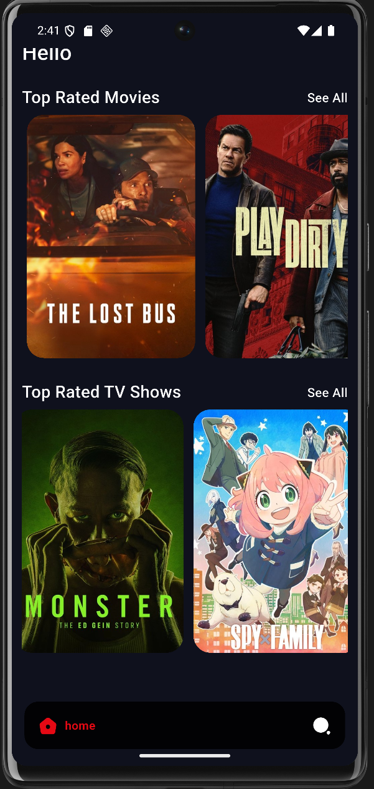
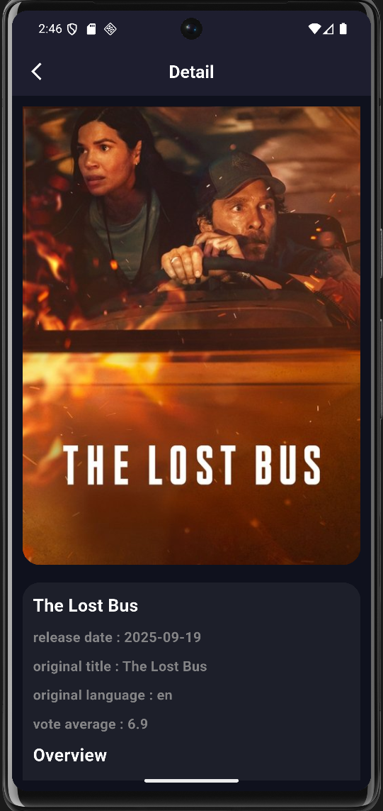
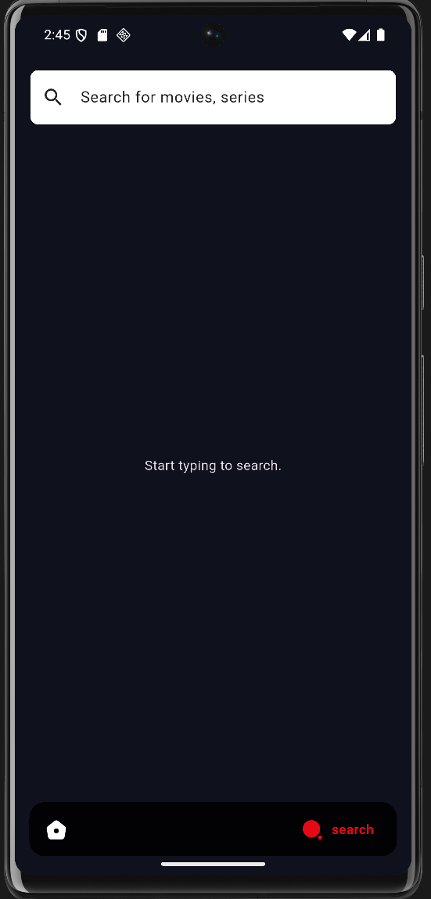
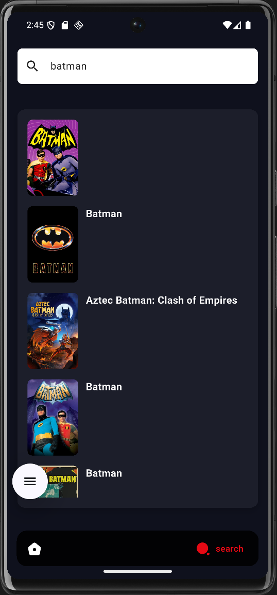

MovieApp – Une application de films moderne


**MovieApp** est une application mobile développée avec **Flutter** qui permet de découvrir, rechercher et explorer des films à travers une interface moderne et intuitive.  
Ce projet met en avant une **architecture modulaire, propre et maintenable**, basée sur le pattern **Clean Architecture + BLoC**.

---

## Fonctionnalités

-  **Découverte de films** – Liste des films populaires ou récents  
-  **Recherche avancée** – Trouvez rapidement un film par titre  
-  **Architecture modulaire** – Séparation claire des couches `data`, `domain` et `presentation`  
-  **Performances optimisées** – Requêtes rapides et gestion d’état fluide via BLoC  
-  **Interface moderne** – UI responsive et élégante  

---

##  Plateformes supportées

-  Android  
-  iOS  

---

## Installation

1. Installer le **Flutter SDK** : [Guide officiel](https://flutter.dev/docs/get-started/install)  
2. Cloner le dépôt :  
```bash
git clone https://github.com/Serhat6863/MovieApp.git
```
3. Accéder au dossier du projet et installer les dépendances :
```bash
cd myapp
flutter pub get
```
4. Générer le code nécessaire (Retrofit, JSON, etc.)
```bash
 flutter pub run build_runner build --delete-conflicting-outputs
```
5. Run the app on your desired platform:
```bash
flutter run
```

---

## Prérequis

Avant de lancer **MovieApp**, assurez-vous d’avoir :

-  **Flutter SDK ≥ 3.7.2**  
-  **Dart SDK ≥ 2.19**
-  **Android Studio** ou **VS Code** avec l’extension Flutter  
-  **Émulateur Android/iOS** ou un appareil physique pour tester l’application

---

## Exécuter un test
-Pour executer un test 
```bash
flutter test
```
---

## Usage

Cette section vous guide à travers les principales fonctionnalités de MovieApp.

## Écran d’accueil

Dès le lancement de l’application, vous accédez à la page d’accueil présentant les films et séries les mieux notés.

-Top Rated Movies : découvrez les films les plus populaires du moment.
-Top Rated TV Shows : explorez les meilleures séries actuelles.
-Vous pouvez faire défiler horizontalement pour parcourir les affiches.

## Écran de recherche

Cet écran vous permet de rechercher n’importe quel film ou série grâce à la barre de recherche située en haut.

-Tapez le nom d’un film ou d’une série (ex. : Batman).
-Les résultats s’affichent instantanément avec les affiches correspondantes.

## Écran de détails

Après avoir sélectionné un film ou une série, vous accédez à une page détaillée :

-Affiche haute qualité
-Titre original
-Date de sortie
-Langue originale
-Note moyenne
-Section “Overview” pour lire le résumé

## Navigation

L’application propose une barre de navigation inférieure vous permettant de passer facilement d’un écran à l’autre :

-Home : accéder à la page principale
-Search : effectuer une recherche rapide

##  Captures d’écran et Démonstration

Découvrez un aperçu visuel de **MovieApp**.

---

###  Écran d’accueil & Détails d’un film
> Explorez les films et séries les mieux notés, puis accédez à une fiche détaillée en un clic.

<p align="center">
  
  
</p>

---

###  Recherche de films & séries
> Recherchez instantanément vos films et séries préférés grâce à une interface simple et réactive.

<p align="center">
  
  
</p>

---

###  Démonstration vidéo
> Découvrez l’expérience complète en action : transitions, navigation et animations intégrées.

<p align="center">
  
</p>

---
## Architecture du projet

Voici l’arborescence du projet **MovieApp** :

```bash
MovieApp/
├── android/                        
├── ios/                            
├── lib/                            
│   ├── core/                       
│   │   └── constant.dart           
│   ├── features/                   
│   │   ├── home/                   
│   │   │   ├── data/               
│   │   │   ├── domain/             
│   │   │   └── presentation/       
│   │   └── search/                 
│   │       ├── data/               
│   │       ├── domain/             
│   │       └── presentation/       
│   └── main.dart                   
├── linux/                          
├── macos/                          
├── screenshots/                    # Captures d’écran utilisées dans le README
├── test/                           
│   └── features/                   
│       ├── home/                   
│       │   ├── data/               
│       │   └── presentation/       
│       │       └── bloc/           
│       └── search/                 
│           ├── data/               
│           └── presentation/       
│               └── bloc/           
├── web/                            
├── windows/                        
├── .gitignore                      
├── README.md                       
├── pubspec.yaml                    
├── pubspec.lock                    
├── analysis_options.yaml           
└── .metadata

```

---

### Description des dossiers

- **core/** → contient les **constantes globales**, les **couleurs**, les **styles** et les **utilitaires** réutilisables dans toute l’application.  
- **features/home/** → gère **l’affichage des films et séries les mieux notés**, incluant la logique de récupération et la présentation des données.  
- **features/search/** → contient toute la **logique de recherche** (films, séries) avec l’autocomplétion et la navigation vers les détails.  
- **data/** → responsable de la **récupération, du parsing et de la transformation des données** (API TMDB, modèles, repositories).  
- **domain/** → définit la **logique métier** de l’application (entités, interfaces de repository, use cases).  
- **presentation/** → représente la **couche interface utilisateur (UI)**, avec les **écrans**, **widgets personnalisés**, et la **gestion d’état via BLoC**.  
- **test/** → contient les **tests unitaires et d’intégration**, assurant la stabilité et la fiabilité du projet.  
- **screenshots/** → regroupe les **captures d’écran et GIFs** utilisés dans la documentation (README).  
---


## Contact  

Si vous souhaitez en savoir plus sur ce projet ou discuter de développement Flutter, n’hésitez pas à me contacter :  

**kurkluserhat@gmail.com**   
[GitHub – Serhat6863](https://github.com/Serhat6863)  

---

✨ Développé avec **Flutter**  
© 2025 – Serhat KÜRKLÜ


